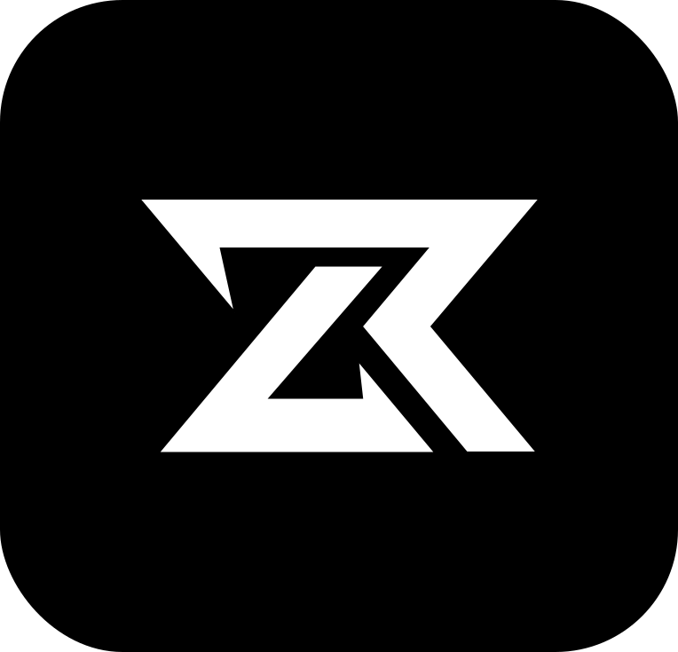

# Zevrin

<table align="center">
  <tr>
    <td>
      
    </td>
    <td style="vertical-align: middle; padding-left: 12px;">
      <span style="font-size: 1.3rem; font-weight: 600;">
        Zevrin — The AI-driven trading ecosystem redefining trust, automation, and commerce. 
      </span>
    </td>
  </tr>
</table>


## Overview

**Zevrin** is a **proprietary mono-repository** powering a next-generation **digital trading ecosystem** connecting buyers, sellers, and dealers on a unified platform.

It introduces **AI-driven automation**, **trust-based transactions**, and **multi-application integrations** — engineered for **scalability**, **security**, and **enterprise-grade performance**.

The system is built to handle **complex deal flows**, **AI-assisted fraud detection**, and **content automation** such as summarization, trailer generation, and product visualization.


## Core Features

* **Unified Trading Platform** – A connected network for buyers, sellers, and verified dealers.
* **Credit Score Integration** – Enables transparent, trust-based trading.
* **Dealer Profiles** – Access insights and performance metrics of verified dealers.
* **AI-Enhanced Services** –

  * **Deal Summarization** – Auto-generate key highlights of deals.
  * **Trailer Generation** – AI-powered media creation for product promotions.
  * **Image Generation** – Auto-rendered visuals for listed products.
  * **Smart Notes** – Automated deal and performance note tracking.
  * **Fraud Detection** – Real-time AI models detect and flag anomalies.
* **NestJS Microservices Architecture** – Modular, scalable, and independently deployable.
* **JWT Authentication** – Secure and stateless access control.


## Tech Stack

### Frontend

* **React + TypeScript** – Dynamic, type-safe user interface.
* **ShadCN + TailwindCSS** – Modern, accessible, and polished UI system.
* **Next.js (Landing Page)** – SEO-optimized marketing and onboarding site.

### Backend

* **NestJS Microservices** – Fault-tolerant modular backend for distributed processing.
* **Kafka / gRPC** – Communication backbone between services.
* **MongoDB / PostgreSQL** – Flexible hybrid database strategy.
* **Redis** – High-speed caching and real-time message queues.

### Infrastructure

* **Docker & Docker Compose** – Fully containerized for local and cloud deployment.
* **Infra Layer** – Dedicated infrastructure for data persistence and messaging.
* **AI Model Integrations** – Supports local and cloud-based AI models.


## Project Structure

```
Zevrin/
│
├── app-frontend/             # Web app frontend (React + ShadCN + TypeScript)
│   ├── src/
│   ├── public/
│
├── landing/                  # SEO-optimized marketing site (Next.js)
│   ├── pages/
│   ├── components/
│
├── app-microservices/        # NestJS microservices (Deals, Payments, Auth, Notifications, etc.)
│   ├── deals/
│   ├── payments/
│   ├── notifications/
│   ├── api-gateway/
│   ├── libs/                 # Shared models, DTOs, and utilities
│
├── infra/                    # Infrastructure services
│   ├── postgres-db/
│   ├── mongo-db/
│   ├── kafka/
│   ├── redis/
│   ├── docker-compose.yml
│
└── README.md
```

---

## Scalability & Vision

Zevrin is designed as a **future-ready trading ecosystem**, integrating **AI, automation, and data intelligence** for large-scale operations.
The architecture supports:

* **Horizontal scaling across microservices.**
* **AI-based decisioning and fraud intelligence.**
* **Interoperability with external APIs and credit scoring systems.**
* **Advanced observability and service monitoring.**

---

## Author

Developed by [**Aswajith S**](https://github.com/Aswajith7077)
Focused on building **AI-powered, scalable ecosystems** that bridge intelligence, commerce, and automation.

